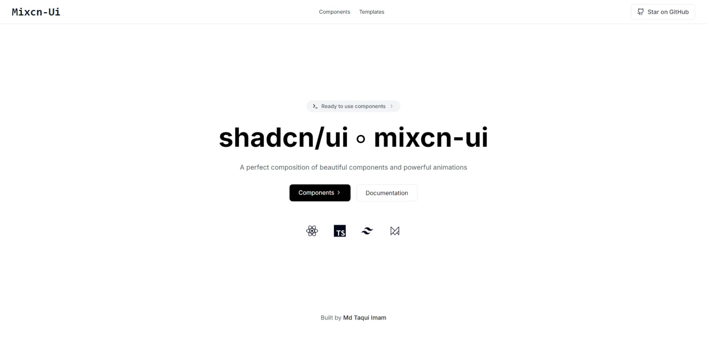

# Mixcn-UI



A perfect composition of beautiful components and powerful animations. Mixcn-UI is a modern, responsive UI component library built with React and TypeScript.

## 🚀 Features

- 🎨 Beautiful, modern component designs
- ⚡ Highly performant and lightweight
- 📱 Fully responsive components
- 🎭 Powerful animation system
- 🔧 Easy to customize
- 📦 Tree-shakeable
- 🎯 TypeScript support

## 🛠️ Tech Stack

- [React](https://reactjs.org/)
- [TypeScript](https://www.typescriptlang.org/)
- [Next.js](https://nextjs.org/)
- [Tailwind CSS](https://tailwindcss.com/)
- [Framer Motion](https://www.framer.com/motion/)

## 🚀 Getting Started

First, install the package:

```bash
npm install mixcn-ui
# or
yarn add mixcn-ui
# or
pnpm add mixcn-ui
```

Then, run the development server:

```bash
npm run dev
# or
yarn dev
# or
pnpm dev
```

Open [http://localhost:3000](http://localhost:3000) with your browser to see the result.

## 📚 Documentation

Visit our [documentation](https://mixcn-ui.com/docs) to learn more about:
- Component API
- Theming
- Animations
- Best practices
- Examples

## 🤝 Contributing

We love your input! We want to make contributing to Mixcn-UI as easy and transparent as possible. Here's how you can contribute:

1. Fork the repo
   ```bash
   https://github.com/shadcn/mixcn-ui.git
   ```

2. Clone your fork
   ```bash
   git clone https://github.com/your-username/mixcn-ui.git
   ```

3. Create your feature branch
   ```bash
   git checkout -b feature/AmazingFeature
   ```

4. Make your changes and commit
   ```bash
   git commit -m 'Add some AmazingFeature'
   ```

5. Push to the branch
   ```bash
   git push origin feature/AmazingFeature
   ```

6. Open a Pull Request

### Development Guidelines

- Follow the existing code style
- Write meaningful commit messages
- Add tests for new features
- Update documentation as needed
- Ensure all tests pass before submitting PR

## 📄 License

This project is licensed under the MIT License - see the [LICENSE](LICENSE) file for details.

## 💖 Credits

Built with love by [Md Taqui Imam](https://github.com/mdtaquiimam)

## 🤝 Support

- Star this repository
- Follow us on [Twitter](https://twitter.com/mixcn_ui)
- Join our [Discord community](https://discord.gg/mixcn-ui)

---

<p align="center">Made with ❤️ by the Mixcn-UI team</p>
